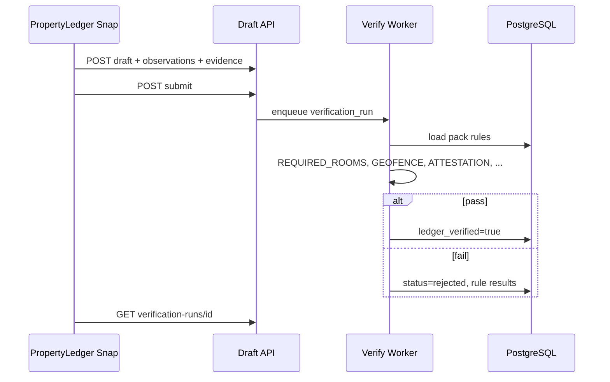

# API Surface Sketch v0 — Ledger-verified

**Last updated:** 2026-06-20  
**Maps to:** `ARCHITECTURE_v0.md` · **Not implemented** — contract sketch only

---

## Principles

- All field submits land as **draft** until `verification_run.overall_pass = true`.
- Idempotent submit keys per device session (`client_session_id` + observation index).
- Evidence uploaded separately; JSON references `evidence_object_id` after upload.
- No endpoint sets `ledger_verified=true` synchronously in the request path — worker only.

---

## Auth (sketch)

| Role | Method |
|------|--------|
| Field tech (PropertyLedger app) | Device registration + org API key + tech JWT |
| PM / owner read | Party-scoped token |
| Buyer report | Paid `report_order` token |

---

## Endpoints

### `POST /v1/events/draft`

Create or update a draft `ledger_event` shell.

```json
{
  "client_session_id": "uuid",
  "standard_pack_code": "property-str-turnover-v1",
  "event_type": "inspection",
  "event_subtype": "move_out",
  "asset_ref": "STR-Wildwood-Unit-12",
  "certified_tech_id": "uuid",
  "started_at": "2026-06-20T14:00:00Z",
  "capture_gps": { "lat": 38.985, "lon": -74.81 }
}
```

**Response:** `{ "event_id": "uuid", "status": "draft" }`

---

### `POST /v1/events/{event_id}/observations`

Append `event_condition_observation` rows (matches Snap export shape).

```json
{
  "room_code": "kitchen",
  "taxonomy_code": "property.room.appliances.condition",
  "severity": "minor",
  "human_description": "...",
  "ai_description": "...",
  "ai_backend": "pocket_pal_paste",
  "comparison_to_prior": "not_applicable",
  "evidence": {
    "sha256": "...",
    "captured_at": "...",
    "gps": { "lat": 38.985, "lon": -74.81 }
  }
}
```

**Response:** `{ "observation_id": "uuid", "status": "draft" }`

---

### `POST /v1/evidence/upload`

Multipart: photo bytes + `sha256` + `event_id`. Server verifies hash, stores blob, writes `chain_of_custody_log`.

**Response:** `{ "evidence_object_id": "uuid" }`

---

### `POST /v1/events/{event_id}/submit`

Locks draft for verification — no more edits.

**Response:** `{ "event_id": "uuid", "status": "submitted", "verification_run_id": "uuid" }`

---

### `GET /v1/verification-runs/{id}`

Poll worker result.

```json
{
  "overall_pass": false,
  "status": "complete",
  "rules": [
    { "code": "REQUIRED_ROOMS_CAPTURED", "pass": false, "detail": "missing bathroom_1" },
    { "code": "NEVER_STAMP_DEMO", "pass": true }
  ]
}
```

On pass: `ledger_event.ledger_verified = true` (async commit).

---

### `POST /v1/events/{event_id}/attestations`

Neutral inspector sign-off (required before stamp for property pack).

```json
{
  "attestor_type": "tech",
  "statement_code": "neutral_inspector_v1",
  "signed_at": "2026-06-20T15:00:00Z"
}
```

---

### `GET /v1/reports/{report_order_id}`

Buyer-facing read — **verified events only**.

---

## Worker flow



---

## Snap demo → API mapping

| Snap export field | API |
|-------------------|-----|
| Full session JSON | `POST draft` + N × `observations` + evidence uploads |
| `verify_export.py` | Worker rule subset (client-side pre-check) |
| Share sheet export | Replace with `submit` + poll |

---

## Next implementation order

1. PostgreSQL DDL from `ARCHITECTURE_v0`
2. `POST /events/draft` + observation append (SQLite or Postgres stub)
3. Verification worker with pack rules from JSON standard packs
4. Replace Snap JSON export with API sync (offline queue)
