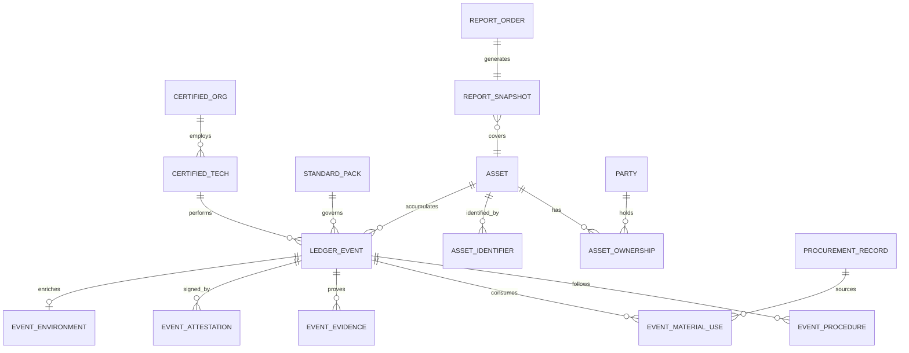

# Ledger-verified Platform — Data Architecture v0

**Phase 5 schema on row one · Evidentiary compliance ledger**  
**AI Integration and Consulting LLC · 2026**  
**Status:** Architectural specification — not yet physical DB deployment

---

## Document purpose

This is the **relational blueprint** a DBA can implement tomorrow. Every table and field exists from **event #1**; values may be **null** where noted, **columns never appear later**. Only **verification-passed** events enter the **trusted ledger** (public reports, resale packets, buyer search).

**Naming firewall:** This stack is **not** `ledger_core` / The Ledger Series (interview/memoir). See `LEDGER_VERIFIED.md`.

---

## Design principles

| # | Principle |
|---|-----------|
| 1 | **Asset-centric** — history attaches to the asset, not the owner |
| 2 | **Append-only trusted history** — no silent edits; corrections = **amendment events** |
| 3 | **Verification gate** — fail spec → event stored as `draft` or `rejected`, **not** Ledger-verified |
| 4 | **Procurement precedes consumption** — materials linked to purchases that **predate** the work event when required |
| 5 | **Evidence is hashed** — photos/files tamper-evident; metadata from device + server |
| 6 | **Standard packs are versioned** — every accepted event cites `standard_pack_id` + version |
| 7 | **Geospatial proof** — capture location + optional geofence match to asset site |
| 8 | **Enrichment is additive** — weather/region data attaches but does not replace primary evidence |
| 9 | **Search indexes verified facts only** — buyer/insurer queries hit `ledger_events`, not drafts |
| 10 | **Multi-vertical, one spine** — ag, marine, fleet, property share core tables; vertical detail in extension tables |

---

## Field notation (used throughout)

| Code | Meaning |
|------|---------|
| **R** | Required when record is created |
| **V** | Required before **Ledger-verified** status |
| **O** | Optional; column exists from day one |
| **I** | Immutable after first commit |
| **IDX** | Indexed for query / search |

---

## High-level entity map

---

## Comparable platforms — what they capture vs Ledger-verified

| Source | Typical data captured | Weakness | Ledger-verified extension |
|--------|----------------------|----------|---------------------------|
| **CARFAX** | VIN, title, odometer, reported service/accident flags | Self-reported service; no material spec; no verification gate | **Verified** materials, provider cert, geofence, procurement chain, standard pack pass |
| **FAA logbook culture** | Hours, cycles, AD compliance, part #, A&P signature, date | Paper/PDF; inconsistent digital; not cross-asset searchable at scale | Same rigor **digitally enforced** + immutable hash + buyer search API |
| **Marine survey / documented history** | Hull ID, engine hours, survey findings, maintenance log | Survey is point-in-time; ongoing maintenance uneven | Continuous event stream + **before/during/after** evidence per work order |
| **OEM / John Deere telematics** | Machine ID, engine hours, fault codes, dealer service | Dealer silo; buyer access limited; spec on fluids often absent | **Brand-agnostic** ledger; fluid SKU/lot; third-party certified providers |
| **Property inspection apps** | Photos, room labels, timestamps | No standard pack; no procurement; landlord-biased | **Neutral third party**, taxonomy, chain of custody, legal/evidentiary fields |
| **Fleet maintenance SaaS** | Work orders, parts, labor hours | Internal fleet only; rarely resale-facing; weak buyer product | **Institutional report product** + portable asset history |

**Multiplier thesis:** competitors record **claims**; we record **verified compliance** against a published standard—with procurement, geolocation, and attestation chains they do not require.

---

## Core registry

### `asset`

Permanent anchor. Survives ownership change.

| Field | Type | Null | Flags | Description |
|-------|------|------|-------|-------------|
| `asset_id` | UUID | no | R, I, IDX | Primary key — never reused |
| `asset_class` | enum | no | R, IDX | `property`, `marine`, `ag`, `aviation`, `fleet`, `medical`, `industrial`, `other` |
| `asset_subclass` | varchar | yes | O | e.g. `combine`, `yacht`, `harley_davidson`, `str_unit` |
| `display_name` | varchar | yes | O | Human label |
| `value_tier` | enum | no | R, IDX | `standard`, `premium`, `ultra` — pricing & evidence strictness |
| `primary_site_id` | FK → `site` | yes | O, IDX | Home berth, farm, address, hangar |
| `manufacturer` | varchar | yes | O | |
| `model` | varchar | yes | O | |
| `model_year` | int | yes | O | |
| `status` | enum | no | R | `active`, `retired`, `scrapped`, `transferred` |
| `created_at` | timestamptz | no | R, I | |
| `retired_at` | timestamptz | yes | O | |

### `asset_identifier`

Multiple IDs per asset (VIN, hull, serial, property parcel, etc.).

| Field | Type | Null | Flags | Description |
|-------|------|------|-------|-------------|
| `identifier_id` | UUID | no | R, I | |
| `asset_id` | FK | no | R, IDX | |
| `id_type` | enum | no | R, IDX | `vin`, `hin`, `serial`, `tail_number`, `parcel`, `listing_id`, `custom` |
| `id_value` | varchar | no | R, I, IDX | Normalized value |
| `issuing_authority` | varchar | yes | O | |
| `is_primary` | bool | no | R | |
| `valid_from` | date | yes | O | |
| `valid_to` | date | yes | O | |

### `site`

Physical location — property, dock, field, shop bay.

| Field | Type | Null | Flags | Description |
|-------|------|------|-------|-------------|
| `site_id` | UUID | no | R, I | |
| `label` | varchar | yes | O | |
| `address_line1` | varchar | yes | O | |
| `address_line2` | varchar | yes | O | |
| `city` | varchar | yes | O, IDX | |
| `state_province` | varchar | yes | O, IDX | |
| `postal_code` | varchar | yes | O | |
| `country` | char(2) | yes | O | ISO |
| `latitude` | decimal(9,6) | yes | O | |
| `longitude` | decimal(9,6) | yes | O | |
| `geofence_radius_m` | int | yes | O | Default capture tolerance |
| `timezone` | varchar | yes | O | |

### `party`

Owners, buyers, insurers, tenants — legal entities or persons.

| Field | Type | Null | Flags | Description |
|-------|------|------|-------|-------------|
| `party_id` | UUID | no | R, I | |
| `party_type` | enum | no | R | `individual`, `organization` |
| `legal_name` | varchar | no | R | |
| `display_name` | varchar | yes | O | |
| `tax_id_hash` | varchar | yes | O | Stored hashed |
| `contact_email` | varchar | yes | O | |
| `contact_phone` | varchar | yes | O | |
| `created_at` | timestamptz | no | R, I | |

### `asset_ownership`

Links party ↔ asset over time.

| Field | Type | Null | Flags | Description |
|-------|------|------|-------|-------------|
| `ownership_id` | UUID | no | R, I | |
| `asset_id` | FK | no | R, IDX | |
| `party_id` | FK | no | R, IDX | |
| `role` | enum | no | R | `owner`, `operator`, `lessor`, `lessee` |
| `effective_from` | timestamptz | no | R, I | |
| `effective_to` | timestamptz | yes | O | null = current |
| `transfer_event_id` | FK → ledger_event | yes | O | Optional link to transfer event |

---

## Standards & compliance engine

### `standard_pack`

Versioned rule set per vertical (e.g. `marine-diesel-oil-v1`, `ag-combine-service-v1`).

| Field | Type | Null | Flags | Description |
|-------|------|------|-------|-------------|
| `standard_pack_id` | UUID | no | R, I | |
| `code` | varchar | no | R, I, IDX | Stable slug |
| `version` | varchar | no | R, I | Semver |
| `asset_class` | enum | no | R, IDX | |
| `title` | varchar | no | R | |
| `effective_from` | date | no | R | |
| `effective_to` | date | yes | O | |
| `rules_json` | jsonb | no | R | Machine-readable intervals, materials, procedures |
| `published_at` | timestamptz | no | R, I | |

### `standard_material_spec`

Approved materials for a pack (oil grade, filter tier, etc.).

| Field | Type | Null | Flags | Description |
|-------|------|------|-------|-------------|
| `spec_id` | UUID | no | R, I | |
| `standard_pack_id` | FK | no | R, IDX | |
| `spec_code` | varchar | no | R | e.g. `engine_oil_primary` |
| `description` | text | no | R | |
| `allowed_brands` | jsonb | yes | O | Tier list |
| `allowed_skus` | jsonb | yes | O | Explicit SKU allow-list |
| `min_grade` | varchar | yes | O | API/SAE/etc. |
| `synthetic_required` | bool | yes | O | |
| `max_age_days` | int | yes | O | Shelf life from purchase |

### `standard_procedure_step`

Checklist template for events under a pack.

| Field | Type | Null | Flags | Description |
|-------|------|------|-------|-------------|
| `step_id` | UUID | no | R, I | |
| `standard_pack_id` | FK | no | R, IDX | |
| `step_order` | int | no | R | |
| `step_code` | varchar | no | R | |
| `instruction` | text | no | R | |
| `requires_photo` | bool | no | R | |
| `requires_measurement` | bool | no | R | |
| `measurement_unit` | varchar | yes | O | |

---

## Certified providers

### `certified_org`

Shop, dealer, PropertyLedger field org, marine yard.

| Field | Type | Null | Flags | Description |
|-------|------|------|-------|-------------|
| `org_id` | UUID | no | R, I | |
| `legal_name` | varchar | no | R | |
| `dba_name` | varchar | yes | O | |
| `certification_status` | enum | no | R, IDX | `pending`, `active`, `suspended`, `revoked` |
| `certified_classes` | jsonb | no | R | Asset classes authorized |
| `certified_pack_ids` | jsonb | yes | O | Specific packs |
| `primary_site_id` | FK | yes | O | |
| `insurance_verified_at` | timestamptz | yes | O | |
| `created_at` | timestamptz | no | R, I | |

### `certified_tech`

Individual technician.

| Field | Type | Null | Flags | Description |
|-------|------|------|-------|-------------|
| `tech_id` | UUID | no | R, I | |
| `org_id` | FK | no | R, IDX | |
| `full_name` | varchar | no | R | |
| `employee_code` | varchar | yes | O | |
| `license_type` | varchar | yes | O | A&P, state, etc. |
| `license_number_hash` | varchar | yes | O | |
| `certifications_json` | jsonb | yes | O | |
| `status` | enum | no | R | `active`, `inactive` |

---

## Procurement (materials before use)

### `procurement_record`

Purchase that **predates** install/consumption when pack requires it.

| Field | Type | Null | Flags | Description |
|-------|------|------|-------|-------------|
| `procurement_id` | UUID | no | R, I | |
| `org_id` | FK | yes | O, IDX | Buyer (shop or owner) |
| `vendor_name` | varchar | no | V | |
| `vendor_site_id` | FK | yes | O | |
| `purchase_timestamp` | timestamptz | no | V, I | Must be **before** linked event |
| `invoice_number` | varchar | yes | O | |
| `receipt_file_id` | FK → evidence_object | yes | V | Hashed receipt scan |
| `receipt_hash` | varchar | yes | V, I | SHA-256 of receipt file |
| `total_amount_cents` | int | yes | O | |
| `currency` | char(3) | yes | O | |
| `created_at` | timestamptz | no | R, I | |

### `procurement_line`

| Field | Type | Null | Flags | Description |
|-------|------|------|-------|-------------|
| `line_id` | UUID | no | R, I | |
| `procurement_id` | FK | no | R, IDX | |
| `sku` | varchar | yes | V, IDX | |
| `brand` | varchar | yes | V | |
| `product_name` | varchar | no | V | |
| `grade_spec` | varchar | yes | O | |
| `quantity` | decimal | no | V | |
| `unit` | varchar | no | V | `oz`, `qt`, `each`, etc. |
| `lot_number` | varchar | yes | O, IDX | |
| `batch_number` | varchar | yes | O | |
| `unit_cost_cents` | int | yes | O | |

---

## Ledger events (heart of the system)

### `ledger_event`

Append-only. **Trusted** rows have `verification_status = verified`.

| Field | Type | Null | Flags | Description |
|-------|------|------|-------|-------------|
| `event_id` | UUID | no | R, I, IDX | |
| `asset_id` | FK | no | R, IDX | |
| `event_type` | enum | no | R, IDX | `inspection`, `maintenance`, `repair`, `attestation`, `ownership_transfer`, `amendment` |
| `event_subtype` | varchar | yes | O, IDX | `move_in`, `oil_change`, `100hr`, `turnover` |
| `standard_pack_id` | FK | no | V, IDX | Which rules applied |
| `standard_pack_version` | varchar | no | V, I | Snapshot at verify time |
| `org_id` | FK | yes | V, IDX | Performing org |
| `tech_id` | FK | yes | V, IDX | Performing tech |
| `verification_status` | enum | no | R, IDX | `draft`, `submitted`, `verified`, `rejected`, `superseded` |
| `ledger_verified` | bool | no | R, IDX | **true** only when verified |
| `verified_at` | timestamptz | yes | V, I | |
| `verified_by_party_id` | FK | yes | O | Internal QA reviewer |
| `rejection_reason` | text | yes | O | |
| `started_at` | timestamptz | no | V, I | Time in |
| `completed_at` | timestamptz | no | V, I | Time out |
| `duration_minutes` | int | yes | O | Derived or captured |
| `meter_type` | enum | yes | O | `miles`, `hours`, `cycles`, `none` |
| `meter_reading` | decimal | yes | V | Odometer / hobbs / engine hours |
| `meter_photo_evidence_id` | FK | yes | O | |
| `capture_site_id` | FK | yes | V | Where work occurred |
| `capture_latitude` | decimal | yes | V | |
| `capture_longitude` | decimal | yes | V | |
| `geofence_match` | bool | yes | V | Within asset site radius |
| `geofence_distance_m` | int | yes | O | |
| `device_capture_timestamp` | timestamptz | yes | V | From field device |
| `server_received_at` | timestamptz | no | R, I | |
| `notes_internal` | text | yes | O | Not on public report |
| `notes_public_summary` | text | yes | O | Buyer-safe summary |
| `supersedes_event_id` | FK | yes | O | Amendment chain |
| `created_at` | timestamptz | no | R, I | |

**Immutable after `verification_status = verified`:** all fields except via new `amendment` event.

### `event_procedure_step`

Instance of checklist completion.

| Field | Type | Null | Flags | Description |
|-------|------|------|-------|-------------|
| `instance_id` | UUID | no | R, I | |
| `event_id` | FK | no | R, IDX | |
| `step_code` | varchar | no | V | |
| `completed` | bool | no | V | |
| `completed_at` | timestamptz | yes | V | |
| `measurement_value` | decimal | yes | O | |
| `measurement_unit` | varchar | yes | O | |
| `notes` | text | yes | O | |

### `event_material_use`

Links event → procurement lines + spec compliance.

| Field | Type | Null | Flags | Description |
|-------|------|------|-------|-------------|
| `use_id` | UUID | no | R, I | |
| `event_id` | FK | no | R, IDX | |
| `procurement_line_id` | FK | yes | V, IDX | Purchase predates event |
| `spec_code` | varchar | no | V | From standard pack |
| `brand` | varchar | no | V | |
| `sku` | varchar | yes | V, IDX | |
| `product_name` | varchar | no | V | |
| `quantity_used` | decimal | no | V | e.g. fluid ounces |
| `unit` | varchar | no | V | |
| `lot_number` | varchar | yes | O | |
| `spec_pass` | bool | no | V | Rules engine result |
| `spec_fail_reason` | text | yes | O | |

### `event_condition_observation`

Property / inspection taxonomy (PropertyLedger wedge + universal condition).

| Field | Type | Null | Flags | Description |
|-------|------|------|-------|-------------|
| `observation_id` | UUID | no | R, I | |
| `event_id` | FK | no | R, IDX | |
| `taxonomy_code` | varchar | no | V, IDX | Standardized (room.surface.damage_type) |
| `location_label` | varchar | yes | O | `kitchen`, `port_engine`, `cab` |
| `severity` | enum | yes | O | `none`, `minor`, `moderate`, `major` |
| `description` | text | yes | O | |
| `comparison_to_prior` | enum | yes | O | `unchanged`, `new`, `worsened`, `improved` |

---

## Evidence & media

### `evidence_object`

All files: photos, PDFs, receipts, scans.

| Field | Type | Null | Flags | Description |
|-------|------|------|-------|-------------|
| `evidence_id` | UUID | no | R, I | |
| `storage_uri` | varchar | no | R, I | Object store path |
| `content_hash_sha256` | varchar | no | R, I, IDX | Tamper detection |
| `mime_type` | varchar | no | R | |
| `byte_size` | bigint | no | R | |
| `captured_at` | timestamptz | no | V, I | Device or camera EXIF |
| `uploaded_at` | timestamptz | no | R, I | |
| `capture_latitude` | decimal | yes | O | |
| `capture_longitude` | decimal | yes | O | |
| `capture_device_id` | varchar | yes | O | Registered field device |
| `photo_phase` | enum | yes | O | `before`, `during`, `after`, `meter`, `receipt`, `other` |
| `original_filename` | varchar | yes | O | |

### `event_evidence_link`

| Field | Type | Null | Flags | Description |
|-------|------|------|-------|-------------|
| `link_id` | UUID | no | R, I | |
| `event_id` | FK | no | R, IDX | |
| `evidence_id` | FK | no | R, IDX | |
| `link_role` | varchar | no | R | Required by standard pack |

---

## Attestation & chain of custody

### `event_attestation`

Human/org signature that work occurred to standard.

| Field | Type | Null | Flags | Description |
|-------|------|------|-------|-------------|
| `attestation_id` | UUID | no | R, I | |
| `event_id` | FK | no | R, IDX | |
| `attestor_type` | enum | no | V | `tech`, `supervisor`, `org`, `third_party` |
| `tech_id` | FK | yes | O | |
| `party_id` | FK | yes | O | |
| `statement` | text | yes | O | |
| `signature_type` | enum | no | V | `electronic`, `pin`, `biometric` |
| `signed_at` | timestamptz | no | V, I | |
| `signature_hash` | varchar | yes | O | |

### `chain_of_custody_log`

Audit trail for evidence handling.

| Field | Type | Null | Flags | Description |
|-------|------|------|-------|-------------|
| `custody_id` | UUID | no | R, I | |
| `evidence_id` | FK | no | R, IDX | |
| `action` | enum | no | R | `captured`, `uploaded`, `hashed`, `linked`, `viewed` |
| `actor_party_id` | FK | yes | O | |
| `actor_tech_id` | FK | yes | O | |
| `timestamp` | timestamptz | no | R, I | |
| `ip_address_hash` | varchar | yes | O | |

---

## Environmental enrichment

### `event_environment`

Weather / regional context at event time (additive, not primary proof).

| Field | Type | Null | Flags | Description |
|-------|------|------|-------|-------------|
| `environment_id` | UUID | no | R, I | |
| `event_id` | FK | no | R, IDX | |
| `weather_source` | varchar | yes | O | API provider |
| `temperature_f` | decimal | yes | O | |
| `humidity_pct` | decimal | yes | O | |
| `precipitation_in` | decimal | yes | O | |
| `wind_mph` | decimal | yes | O | |
| `conditions_text` | varchar | yes | O | |
| `region_code` | varchar | yes | O, IDX | Census / market region |
| `enriched_at` | timestamptz | no | R | |

---

## Verification engine (rules execution)

### `verification_run`

Rules engine output per submission.

| Field | Type | Null | Flags | Description |
|-------|------|------|-------|-------------|
| `run_id` | UUID | no | R, I | |
| `event_id` | FK | no | R, IDX | |
| `run_at` | timestamptz | no | R, I | |
| `engine_version` | varchar | no | R | |
| `overall_pass` | bool | no | R, IDX | |
| `rules_evaluated_json` | jsonb | no | R | Full trace |
| `failure_codes` | jsonb | yes | O | |

### `verification_rule_result`

| Field | Type | Null | Flags | Description |
|-------|------|------|-------|-------------|
| `result_id` | UUID | no | R, I | |
| `run_id` | FK | no | R, IDX | |
| `rule_code` | varchar | no | R | e.g. `PROCUREMENT_BEFORE_USE`, `GEOFENCE`, `SKU_ALLOWED` |
| `passed` | bool | no | R | |
| `detail` | text | yes | O | |

**Ledger-verified stamp:** set only when `verification_run.overall_pass = true` and required attestations present.

---

## Reports & monetization

### `report_order`

Buyer/insurer pays for history.

| Field | Type | Null | Flags | Description |
|-------|------|------|-------|-------------|
| `order_id` | UUID | no | R, I | |
| `requester_party_id` | FK | no | R | |
| `asset_id` | FK | no | R, IDX | |
| `report_type` | enum | no | R | `full_history`, `maintenance_summary`, `condition_timeline`, `insurer_compliance` |
| `amount_cents` | int | no | R | |
| `paid_at` | timestamptz | yes | O | |
| `created_at` | timestamptz | no | R, I | |

### `report_snapshot`

Point-in-time export — immutable PDF/data package.

| Field | Type | Null | Flags | Description |
|-------|------|------|-------|-------------|
| `snapshot_id` | UUID | no | R, I | |
| `order_id` | FK | no | R | |
| `generated_at` | timestamptz | no | R, I | |
| `event_count` | int | no | R | Verified events included |
| `snapshot_hash` | varchar | no | R, I | |
| `storage_uri` | varchar | no | R | |

---

## Audit & amendments

### `ledger_amendment`

Corrections without rewriting history.

| Field | Type | Null | Flags | Description |
|-------|------|------|-------|-------------|
| `amendment_id` | UUID | no | R, I | |
| `original_event_id` | FK | no | R, IDX | |
| `amendment_event_id` | FK | no | R | New event of type `amendment` |
| `reason` | text | no | R | |
| `approved_by_party_id` | FK | yes | V | |
| `created_at` | timestamptz | no | R, I | |

### `audit_log`

System-wide immutable audit (admin, access, report pulls).

| Field | Type | Null | Flags | Description |
|-------|------|------|-------|-------------|
| `audit_id` | UUID | no | R, I | |
| `entity_type` | varchar | no | R, IDX | |
| `entity_id` | UUID | no | R, IDX | |
| `action` | varchar | no | R | |
| `actor_id` | UUID | yes | O | |
| `timestamp` | timestamptz | no | R, I, IDX | |
| `payload_json` | jsonb | yes | O | |

---

## Index & search strategy

| Index target | Purpose |
|--------------|---------|
| `asset_id` + `ledger_verified` + `completed_at` | Owner timeline |
| `asset_identifier.id_value` | Buyer lookup by VIN/HIN/serial |
| `event_material_use.sku` + `brand` | Recall / spec audits |
| `certified_org.org_id` + date | Provider performance |
| `verification_status` | QA queue |
| `report_order.asset_id` | Commercial analytics |

**Public search API** returns only `ledger_verified = true` events unless legal hold or owner consent flags apply.

---

## Verification requirements matrix (examples)

| Rule code | Applies to | V-requirement |
|-----------|------------|---------------|
| `GEOFENCE_MATCH` | Field service at asset site | `geofence_match = true` or waiver attestation |
| `PROCUREMENT_PREDATES_EVENT` | Fluid/filter changes | `purchase_timestamp < started_at` |
| `SKU_IN_ALLOW_LIST` | Premium tiers | `event_material_use.spec_pass = true` |
| `METER_READING_PRESENT` | Ag, marine, fleet | `meter_reading` + optional meter photo |
| `PHOTO_BEFORE_AFTER` | All premium maintenance | Linked evidence with phases |
| `TECH_CERTIFIED_FOR_PACK` | All verified events | `tech_id` authorized for `standard_pack_id` |
| `DURATION_LOGGED` | Billable / SLA packs | `started_at`, `completed_at` |
| `REQUIRED_ROOMS_CAPTURED` | Property STR turnover | All pack-required room codes have linked evidence |
| `TAXONOMY_COMPLETE` | Property premium+ | Required `event_condition_observation` codes per room |
| `PRIOR_BASELINE_LINKED` | Property move-in | Links to verified `move_out` on same `asset_id` |
| `CHAIN_OF_CUSTODY_COMPLETE` | Property premium+ | Full `chain_of_custody_log` on all evidence |
| `NEUTRAL_INSPECTOR_ATTESTATION` | Property all tiers | Third-party attestation present |

Waivers are themselves **attested events** — never silent bypass.

---

## Implementation phases (same schema, staged enforcement)

| Stage | What turns on | Schema change |
|-------|---------------|---------------|
| **Day 1** | Asset registry, draft events, photos, basic attestations | **None** — all tables exist |
| **Month 3** | Rules engine v1: geofence + timestamps + photo required | **None** — flip rule flags in pack |
| **Month 6** | Procurement linkage + SKU validation | **None** |
| **Year 1** | Public report orders + buyer search | **None** |
| **Year 2+** | Insurer API, cross-asset analytics | **None** — optional read replicas |

**This is how you start at Phase 5:** strictness increases; **columns never do.**

---

## Technology notes (non-binding)

| Layer | Recommendation |
|-------|----------------|
| Primary DB | PostgreSQL (relational, JSONB for rules trace) |
| Object storage | S3-compatible — evidence files |
| Hashing | SHA-256 at ingest; store hash **before** linking to event |
| API | Event submission API + verification worker + read-only report API |
| Mobile field app | Offline queue → sync with device timestamps |
| Rules engine | Versioned service reading `standard_pack.rules_json` |

Microsoft Access spirit: **normalized tables, clear keys, no duplicate truth.** This spec is that — at enterprise scale.

---

## Related documents

| File | Role |
|------|------|
| `STATE.md` | Project status |
| `LEDGER_VERIFIED.md` | Mark, naming, vision |
| `LEDGER_VERIFIED_Investor_Partner_Brief.md` | Investor / partner narrative |
| `STANDARD_PACK_ag-combine-oil-v1.md` | Ag pack → table mapping |
| `STANDARD_PACK_property-str-turnover-v1.md` | Property turnover pack |
| `standard_packs/*.example.json` | Rules engine input |
| `ARCHITECTURE_v0.md` | **This file** |

---

*Ledger-verified · The Record Stands · v0.1*
